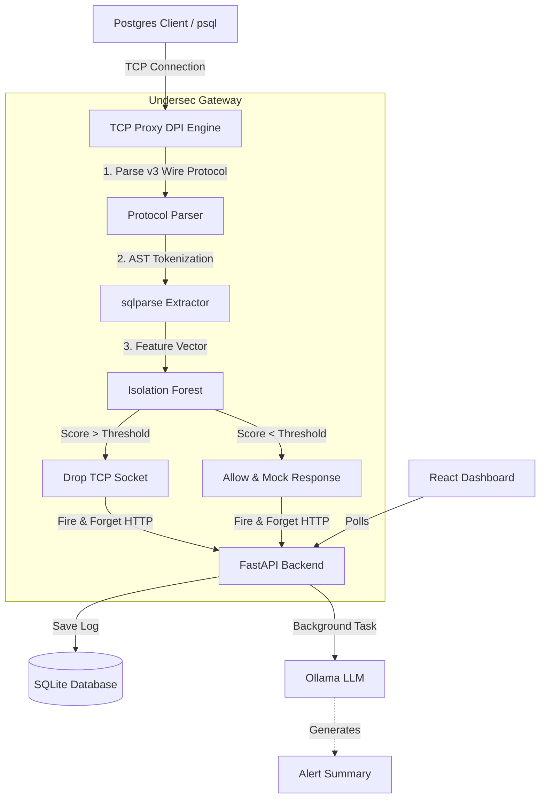

<div align="center">
  
  <h1>Undersec Security Suite</h1>
  <p><b>An infrastructure security tool featuring a custom PostgreSQL TCP proxy (DPI), a YOLO-based CCTV anomaly engine, and an ML-powered Phishing detection extension.</b></p>
  
  <p>
    <a href="https://github.com/Aiman-D/undersec/actions/workflows/test.yml">
      
    </a>
    
    
    
    
    
  </p>
</div>

<br/>

## 🎯 Problem Statement
Traditional firewalls operate at the network layer (L3/L4) or rely on rigid Web Application Firewall (WAF) rules at L7, which frequently miss sophisticated, application-layer database attacks (like obfuscated SQL injections or unauthorized bulk data exfiltration) and emerging phishing domains. 

Undersec bridges this gap by sitting directly in the database connection stream (via a custom TCP proxy) and at the browser level, applying inline Machine Learning to detect behavioral anomalies that rule-based systems miss.

## 🚀 Features

Undersec is a multi-faceted security suite built to protect the modern enterprise.

### 1. Database Security Gateway (TCP Proxy)
- **Zero-Latency Custom Postgres Proxy**: Parses PostgreSQL v3 Wire Protocol using `asyncio` for zero-latency, in-memory query interception.
- **Deep Packet Inspection (DPI)**: Analyzes queries using Abstract Syntax Tree (AST) parsing with `sqlparse` to prevent sophisticated SQL injections and unauthorized schema changes.
- **Inline Machine Learning Inference**: Embeds an Isolation Forest model directly in the proxy loop to detect anomalies without HTTP round-trip latency.
- **GenAI Alert Summarization**: Fire-and-forget integration with local LLMs (Ollama) via background tasks for automated, real-time incident response summarization.

### 2. Physical Security (CCTV Engine)
- **Computer Vision Inference**: Utilizes the `Ultralytics YOLOv8` model for real-time person and object detection on CCTV feeds.
- **Zone Intrusion Detection**: Generates anomaly scores and alerts based on spatial bounding-box rules.

### 3. Client Security (Phishing Extension)
- **XGBoost Phishing Model**: A trained XGBoost model that extracts 7 heuristic features (entropy, IP presence, subdomain depth, etc.) from URLs to detect phishing sites.
- **Chrome Extension integration**: Instantly scores sites in real-time as the user navigates.

## 🧠 Architecture Highlights

Unlike standard CRUD applications, Undersec operates at the network and physical layer.



## ⚖️ Hackathon Trade-offs & Engineering Rigor

This project was originally built during a weekend hackathon. To balance speed of delivery with production reality, the following trade-offs and optimizations were made:

- **Proxy Latency vs Extensibility**: Initially, the proxy made blocking HTTP calls to the backend to score queries. Recognizing this would cause catastrophic database latency under load, it was refactored. The ML model (`predict_query_risk`) is now embedded directly in the proxy loop for sub-millisecond inference, while logging remains asynchronous.
- **Heuristics vs AST Parsing**: Early iterations used regex for SQL injection detection. This was upgraded to full AST parsing (`sqlparse`) to prevent evasion techniques (e.g., hiding payloads in nested comments).
- **Graceful Degradation**: If the local LLM instance (Ollama) goes down or times out, the system automatically falls back to deterministic rule-based alert summarization to ensure security monitoring is never interrupted.

## 🛠️ Tech Stack

- **ML & CV**: `scikit-learn`, `xgboost`, `ultralytics (YOLO)`, `opencv`
- **Proxy**: Python, `asyncio`, `sqlparse`
- **Backend**: FastAPI, SQLAlchemy, SQLite
- **Frontend**: React, Recharts
- **Testing**: `pytest`, `pytest-asyncio`

## 🏃 Getting Started

### 1. Backend & Proxy
```bash
cd backend
python3 -m venv venv
source venv/bin/activate
pip install -r requirements.txt

# Start the API Backend
uvicorn main:app --reload

# In a new terminal, start the TCP Proxy
python tcp_proxy.py
```

### 2. Frontend
```bash
cd frontend
npm install
npm start
```

### 3. Generate Traffic
```bash
# Run the demo runner to simulate normal and malicious database traffic
python demo_runner.py
```

## 🧪 Testing

Undersec includes a robust `pytest` suite for the `feature_extractor` and `postgres_parser`. It is automatically run via GitHub Actions on every push.
```bash
cd backend
PYTHONPATH=. pytest tests/
```

## 🛡️ License
MIT License